# Elektronisches Haushaltsbuch

Oft kann es schwer sein, bei all den finanziellen Transaktionen den Überblick zu behalten. Die hier präsentierte Applikation für das Smartphone soll dabei helfen, das persönliche Budget des Nutzers zu kontrollieren, alle durchgeführten Transaktionen zu verwalten, sowie Einnahmen und Ausgaben zu dokumentieren und zu veranschaulichen. Sämtliche Einnahmen und Ausgaben können eingegeben, kategorisiert und in statistischer Form angezeigt werden. Anhand einer Übersicht werden die letzten Buchungen des Nutzers visuell präsentiert. Das Ziel der Anwendung ist eine mobile, intuitive und schnelle Verwaltung aller durchgeführten Buchungen des Nutzers, sodass dieser stets einen Überblick über seine aktuelle finanzielle Lage hat und die Daten seiner Finanzen jederzeit anpassen kann.

Technische Informationen zur dieser Anwendung finden sich [hier](./docs/Setup.md), eine detaillierte Übersicht über den Anforderungskontext findet sich [hier](./docs/Overview.md). Der Link zur aktuellsten Veröffentlichung [hier](https://github.com/UniRegensburg/ase-abschlussprojekte-ws1920-elektronisches-haushaltsbuch/releases/tag/v2.0).

Die App kann man auch direkt über folgenden Link downloaden: [E-Haushaltsbuch.apk](https://github.com/UniRegensburg/ase-abschlussprojekte-ws1920-elektronisches-haushaltsbuch/releases/download/v2.0/E-Haushaltsbuch.apk)

## Team

|  |  |  |  |
|:-----------------:|:-----------------:|:-----------------:|:-----------------:|
| **Sabrina Hartl**  E-Mail: sabrina1.hartl@stud.uni-regensburg.de  Github-Nutzer: 96Sabiii | **Konstantin Kulik**  E-Mail: konstantin.kulik@stud.uni-regensburg.de  Github-Nutzer: Kotjik | **Nadine Schweiger**   E-Mail: nadine.schweiger@stud.uni-regensburg.de  Github-Nutzer: NadineSchweiger | **Vera Wittmann**    E-Mail: vera1.wittmann@stud.uni-regensburg.de  Github-Nutzer: veraarev |

## Beschreibung

Das elektronische Haushaltsbuch ist in drei Bereiche unterteilt. Über die Navigationsleiste kann zwischen den Menüpunkten Übersicht, Zahlungen und Statistik navigiert werden. Beim Starten der App gelangt man auf die Übersichtsseite, die einen Monatsüberblick und die aktuellsten Buchungen anzeigt, wenn bereits welche angelegt wurden. Der Nutzer erhält Informationen darüber, wie viel Geld er eingenommen hat, wie viel er ausgegeben hat und wie viel ihm aktuell noch zur Verfügung steht. Tippt man auf die Monatsanzeige, kommt ein Menü auf, mit welchem man auswählen kann, für welchen Monat man den Überblick angezeigt bekommen will. Sind noch keine Einträge vorhanden, erscheint ein Einführungsbild, dass auf den Floating Action Button zeigt, um eine neue Buchung zu erstellen.

| 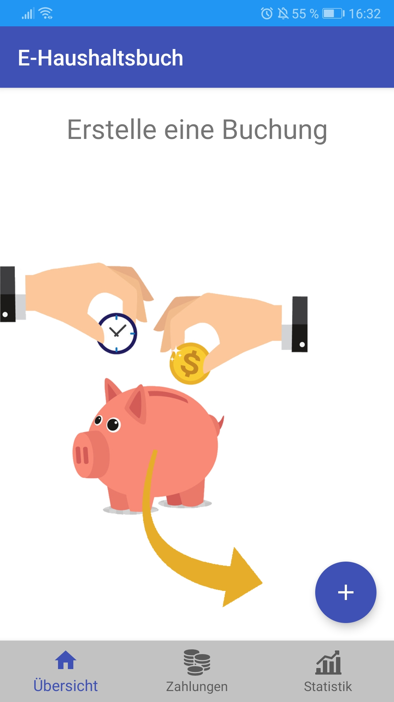 | 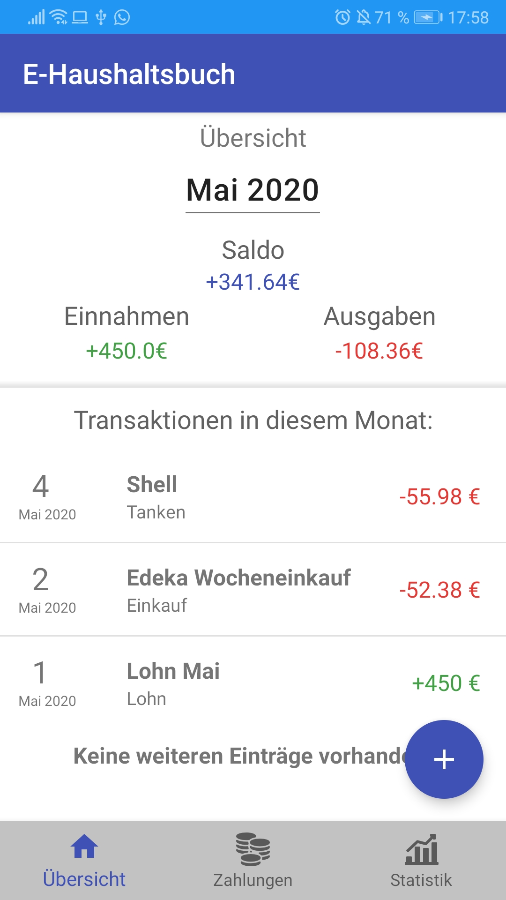 | 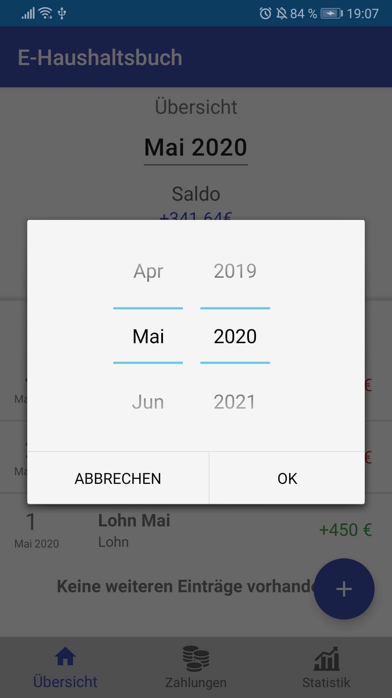 |
|:-----------------:|:-----------------:|:-----------------:|
| Startseite leer | Startseite mit Buchungen | Startseite mit Monatsauswahl |

### Buchung erstellen

Klickt man auf den Floating Action Button, so öffnet sich ein Dialog, in welchem genauere Informationen zur Buchung abgefragt werden. Als Erstes muss man sich entscheiden ob es sich bei der Buchung um eine Einnahme oder Ausgabe handelt. Anschließend werden die weiteren Daten abgefragt. Eine Buchung besteht dabei aus einer Bezeichnung, einem Betrag, einem Datum, einer Zeit, einer Notiz, eine Kategorie und einem Foto. Notiz, Zeit und Foto stellen dabei optionale Eingaben dar. Bleibt eines der Pflichtfelder leer, wird eine Fehlermeldung angezeigt und der Nutzer kann nicht weiterklicken. Die einzelnen Werte werden jeweils separat abgefragt. Hat man alle Eingaben getätigt, so kann man die Einnahme bzw. Ausgabe speichern.

| 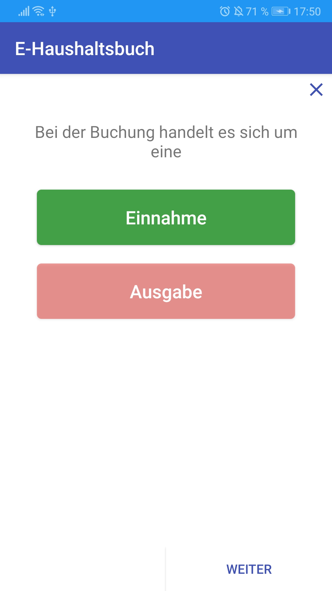 |  | 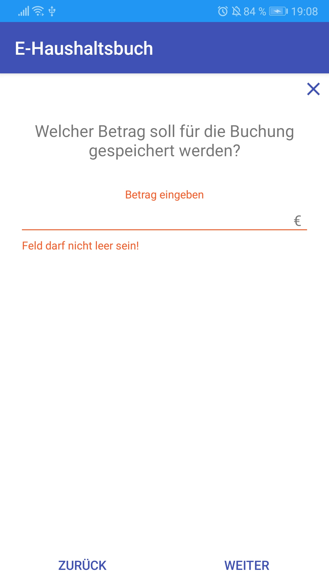 |
|:-----------------:|:-----------------:|:-----------------:|
| Art der Buchung | Name der Buchung | Betrag der Buchung |

| 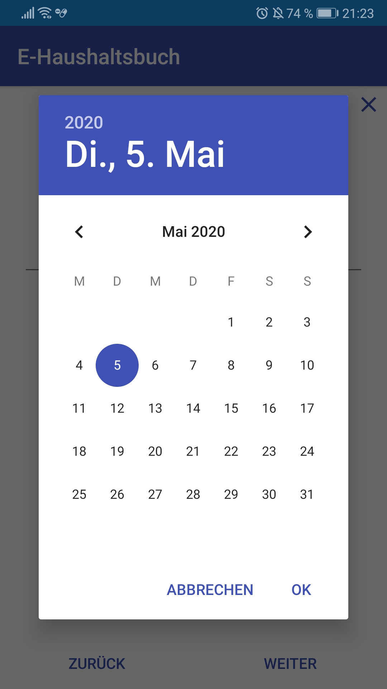 | 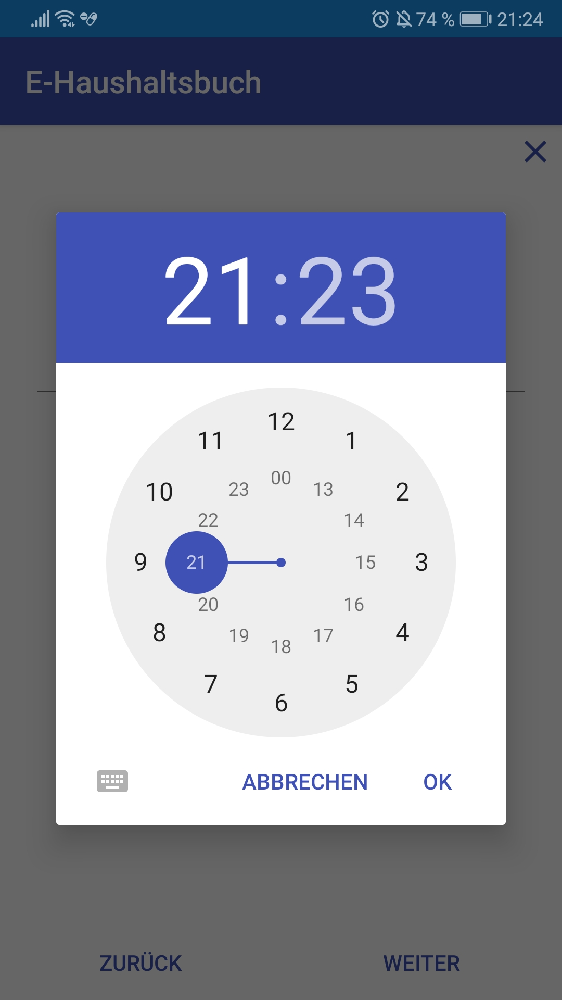 | 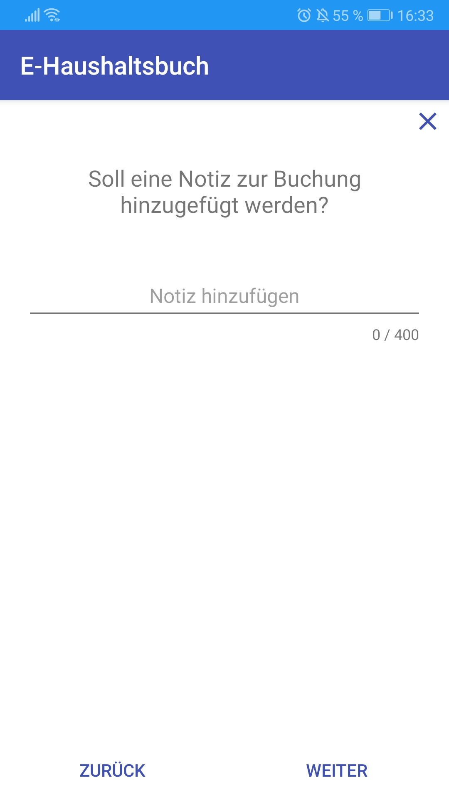 | 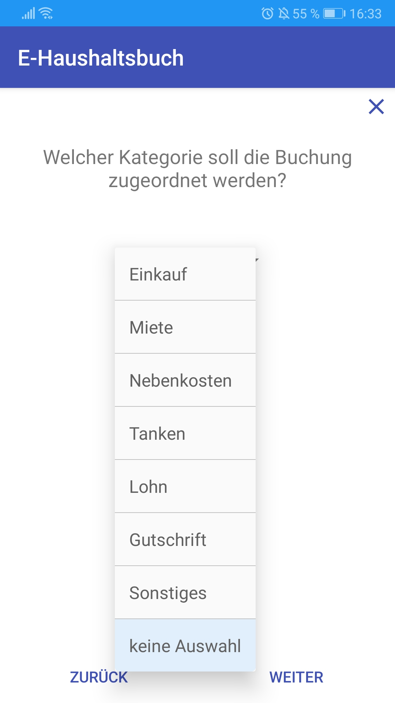 |
|:-----------------:|:-----------------:|:-----------------:|:-----------------:|
| Datum der Buchung | Uhrzeit der Buchung | Notiz zur Buchung | Kategorie der Buchung|

Tippt man bei der Eingabe einer neuen Buchung auf den Button "Foto hinzufügen", kann man über die Kamera des Smartphones ein Foto aufnehmen oder aus der Galerie wählen und dieses der Buchung zuweisen. So kann man beispielsweise ein Foto des Belegs als Nachweis oder ein Bild des gekauften Produkts hinzufügen. Um diese Funktion nutzen zu können, wird beim ersten Mal die Erlaubnis des Nutzers eingeholt, Medien aus dem Speicher des Gerätes verwenden zu dürfen. Wurde die Erlaubnis erteilt, so erscheint keine erneute Abfrage.

| 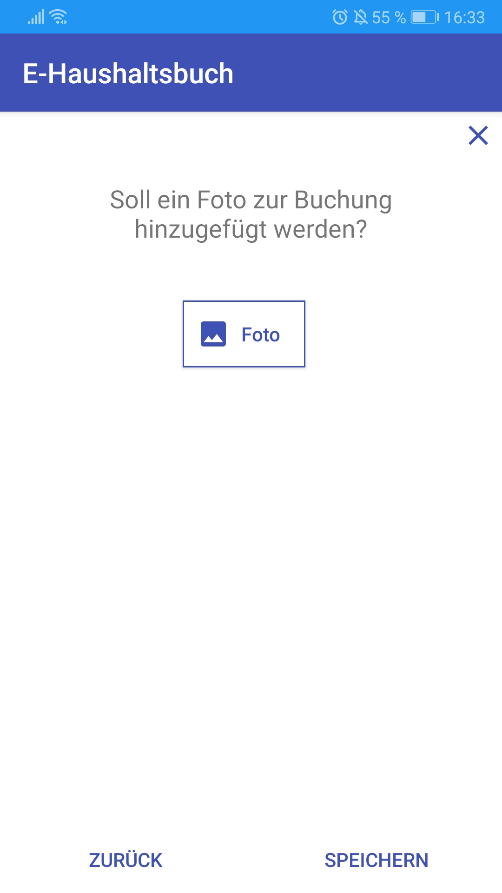 |  | 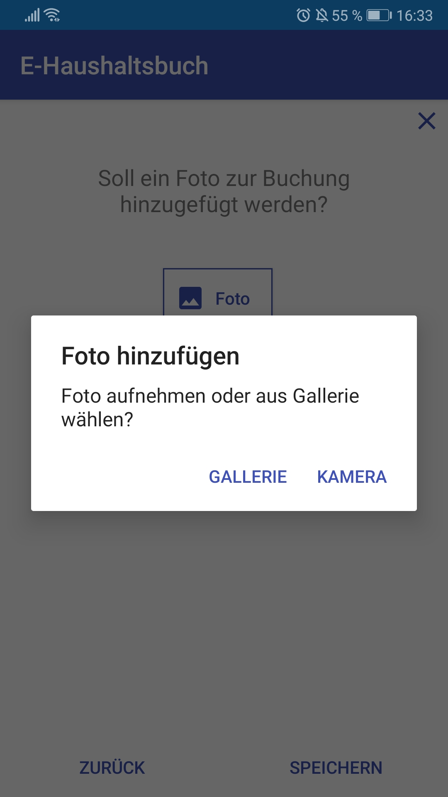 |
|:-----------------:|:-----------------:|:-----------------:|
| Foto zur Buchung | Erlaubnis Media | Fotoauswahl |

### Listenansicht

Mit einem Tipp auf "Zahlungen" auf der Navigationsleiste erhält der Nutzer eine nach absteigendem Datum sortierte Auflistung all seiner Buchungen. Oben findet man die Summe aller bisherigen Einnahmen und Ausgaben. Die Liste der Buchungen kann der Nutzer sowohl durchsuchen als auch bestimmte Kategorien mit Hilfe des Filters auswählen. Will man einen Eintrag löschen, so wischt man den zu löschenden Eintrag einfach zur Seite. Vor dem endgültigen Löschen wir die Aktion noch einmal abgefragt.

| 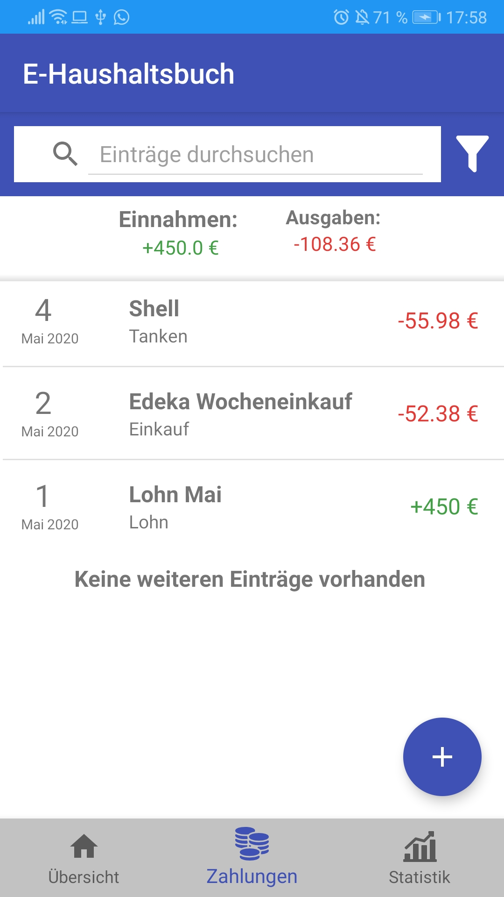 | 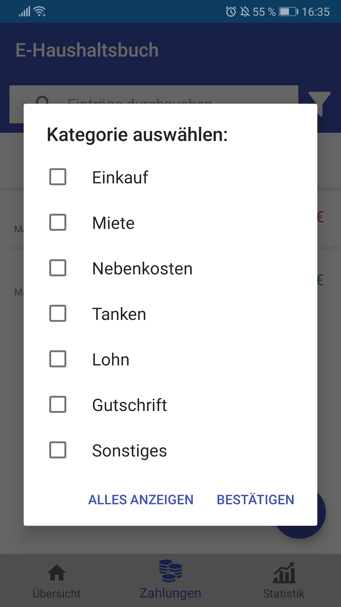 | 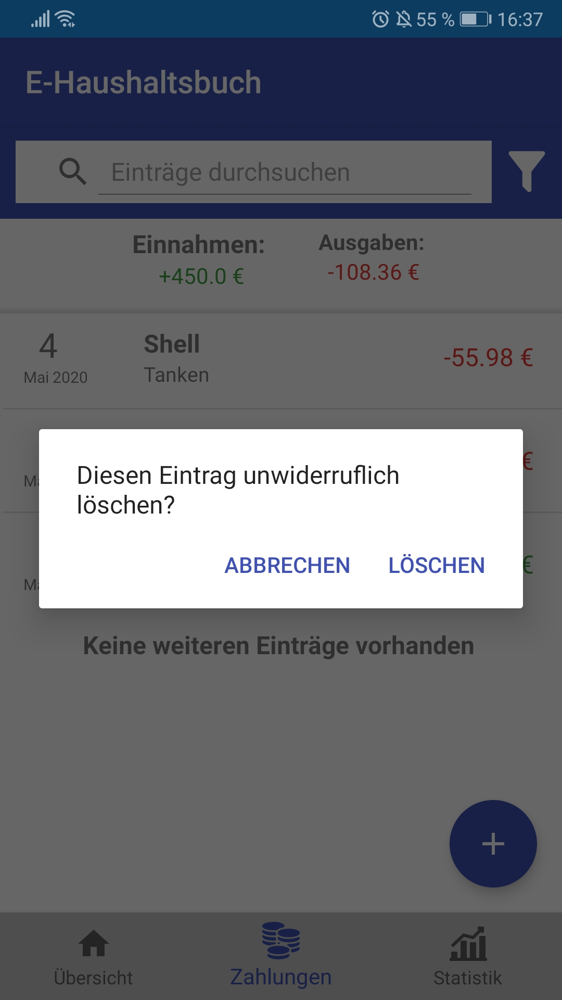 |
|:-----------------:|:-----------------:|:-----------------:|
| Listenansicht aller Buchungen | Filter der Kategorien | Löschen eines Eintrags |

### Detailansicht

Klickt man in der Listenansicht auf einen Eintrag, so gelangt man auf die Detailansicht der ausgewählten Buchung. Hier sieht der Nutzer alle von ihm eingegebenen Informationen auf einen Blick. Über einen Floating Action Button erhält er die Möglichkeiten, den Eintrag zu löschen oder zu bearbeiten. Bevor der Eintrag endgültig gelöscht wird, öffnet sich ein Dialog, um sicherzustellen, dass der Nutzer den Eintrag wirklich löschen möchte. Entscheidet der Nutzer sich dafür, den Eintrag zu bearbeiten, so öffnet sich eine Seite, auf welcher der Nutzer die eingegebenen Informationen bearbeiten kann. Anschließend kann er die geänderten Daten speichern oder die Änderungen verwerfen.

| 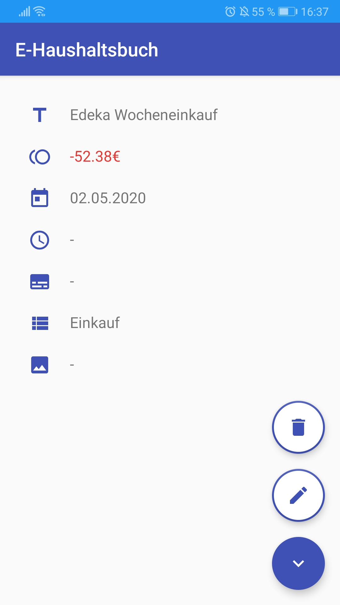 | 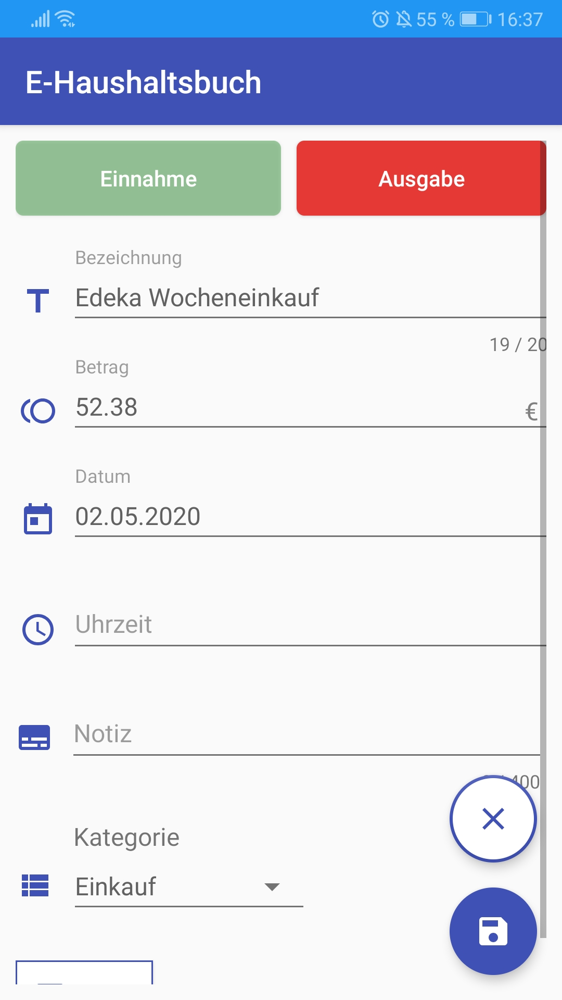 |
|:--------------------:|:--------------------:|
| Detailansicht einer Buchung | Details bearbeiten |

### Statistikseite

Die Statistikseite wird per Klick auf das zugehörige Symbol auf der Navigationsleiste geöffnet. Als Default werden hier die Einnahmen und Ausgaben des letzten Monats in Form eines Balkendiagramms angezeigt. Es besteht zudem die Möglichkeit das Zeitfenster anzupassen und das Diagramm nach Kategorien zu filtern. Klickt der Nutzer auf den Balken mit den Einnahmen, so erhält er eine genauere Auflistung nach den Kategorien (gleiches gilt für Ausgaben). Per Klick auf den Zurück-Pfeil gelangt man wieder auf die Standardeinteilung.

| 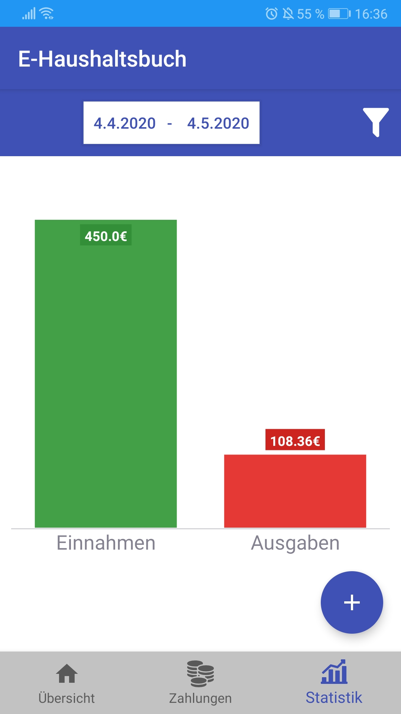 | 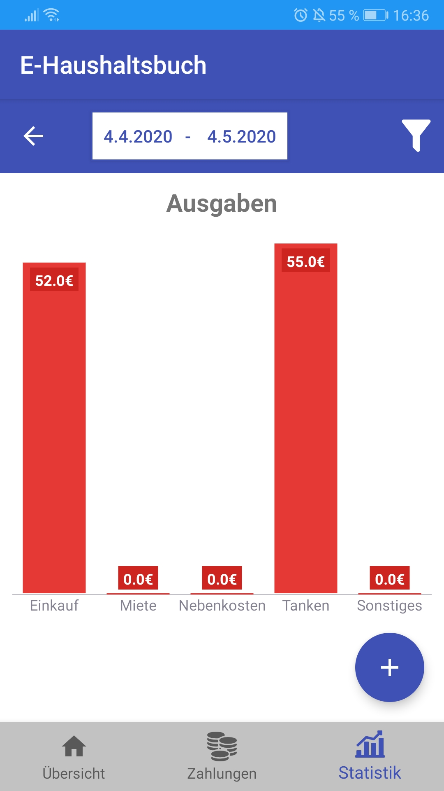 | 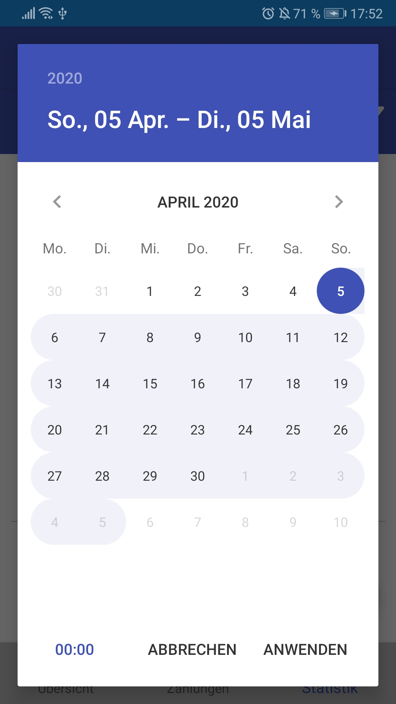 |
|:--------------:|:--------------:|:--------------:|
| Statistikseite | Statistik der Ausgaben | Zeitraum wählen |
